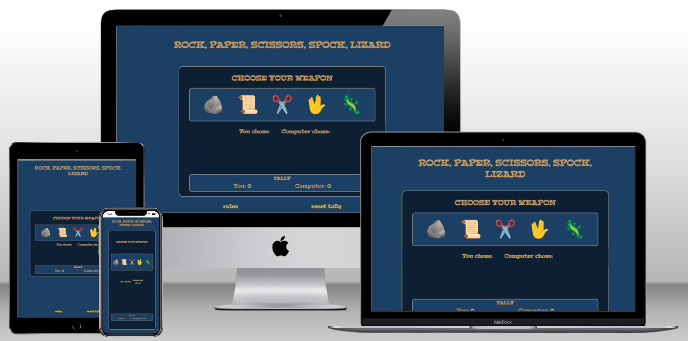
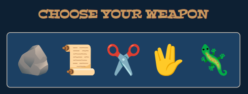
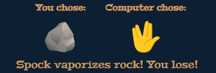
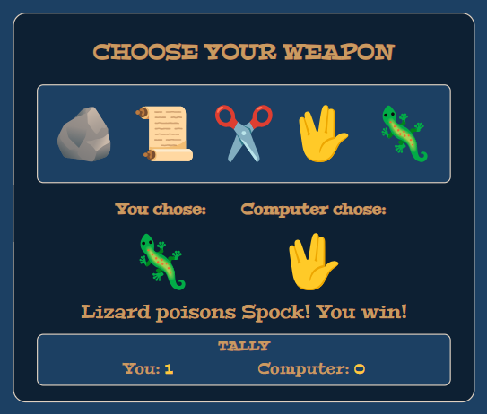
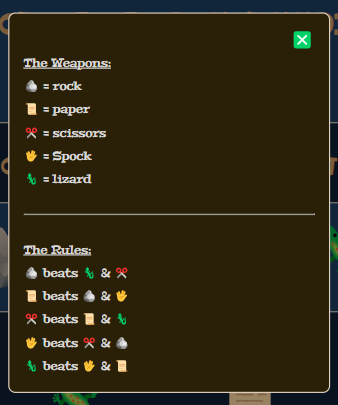
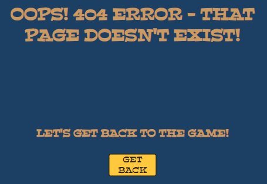
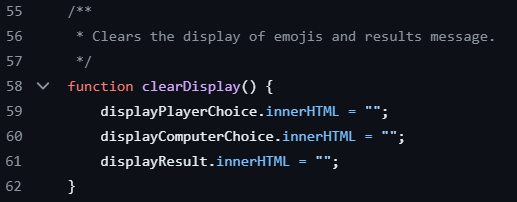
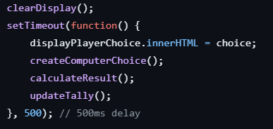

# Rock, Paper, Scissors, Spock, Lizard Game

[View the deployed website here](https://duffew.github.io/rock-paper-scissors-spock-lizard/)

The Rock, Paper, Scissors, Spock, Lizard Game website is a one-page, interactive website upon which, users can play a game of chance. Users of this site are able to:

+ Play the game by selecting emojis
+ View their  result against a randomly generated computer choice
+ View their accumulated score tally
+ Reset the game tally
+ View the rules

This website is fully responsive for a range of screen sizes.

## Features

+ Header - The page opens with a large, clear header, which uses a h1 heading to provide users with the name of the game.

    

*Game heading*

+ Game Area - The main section of the website is the game area, which includes the following features:
    - Game Controls - Large buttons styled as colourful emojis, which users can interact with to make a selection. Users are given clear instructions via the h2 heading. On screens that make use of a mouse, the buttons zoom when hovered over to provide user feedback.

    

    *Game controls*

    - Results Display - Game results are displayed in a table beneath the game controls. The table makes use of clear table headings to indicate both player and computer choices. The table data rows display the chosen emojis. A results message is then shown beneath the table. The results display makes use of a time delay to provide the user with feedback they have made a selection (see Bugs sections below).

    

    *Results display*

    - Game Tally - The tally keeps track of the cumulative scores of the player and computer. The tallies increment by 1 point for each win. The tally can be reset by refreshing the page or selecting the 'Reset Tally' button in the footer.

    

    *Tally*

    

    *Complete game area*

+ Footer - On this site, the footer has been used to place the following features for user convenience:
    - Rules Modal - Selecting the 'rules' text will bring up a modal showing a key to the weapons and a graphical representation of which weapons beat which. The modal can be closed by either selecting the green cross or clicking outside the modal area.
    - Reset Tally - Selecting this text will reset both the player and computer tallies and clear the results area without the user having to refresh the page.

    

    *Rules modal*

    

    *Footer area*

+ 404 Page - This website also makes use of a 404 page. This page informs the user that the page they are looking for does not exist and features a link back to the game.

    

    *404 page*

## dev steps

## testing
### html
### css
### js
### Bugs

+ During development, it became clear that sometimes both the player and computer would make the same selection multiple times in a row. In the instance of a draw, nothing would change on the page and it appeared that the game was frozen. To counter this, I created a clearDisplay() function and a setTimeout() function. These functions ensured that when the user made a selection: 
    - the display would clear
    - the game results would be returned after a short delay
    - the user is sure that that their selection has been actioned

    

    *clearDisplay() function*

    

    *setTimeout() function*

### lessons

## deployment

## techologies used

## lessons

## credits