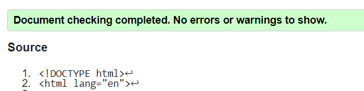
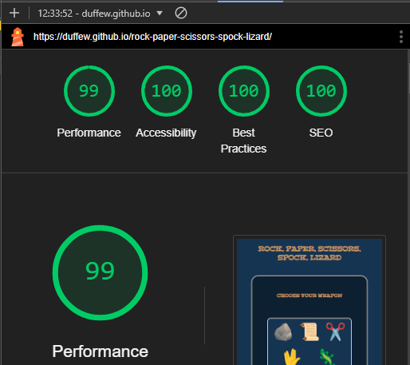
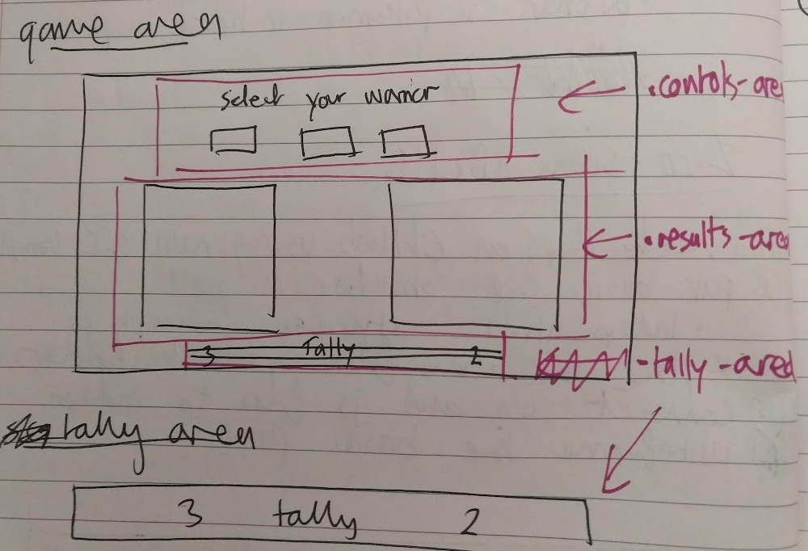

# Rock, Paper, Scissors, Spock, Lizard Game

[View the deployed website here](https://duffew.github.io/rock-paper-scissors-spock-lizard/)

The Rock, Paper, Scissors, Spock, Lizard Game website is a one-page, interactive website upon which, users can play a game of chance. Users of this site are able to:

+ Play the game by selecting emojis
+ View their result against a randomly generated computer choice
+ View their accumulated score tally
+ Reset the game tally
+ View the rules

This website is fully responsive for a range of screen sizes.

## Features

### Existing Features

+ Header - The page opens with a large, clear header, which uses a h1 heading to provide users with the name of the game.

    

*Game heading*

+ Game Area - The main section of the website is the game area, which includes the following features:
    - Game Controls - Large buttons styled as colourful emojis, which users can interact with to make a selection. Users are given clear instructions via the h2 heading. On screens that make use of a mouse, the buttons zoom when hovered over to provide user feedback.

    

    *Game controls*

    - Results Display - Game results are displayed in a table beneath the game controls. The table makes use of clear table headings to indicate both player and computer choices. The table data rows display the chosen emojis. A results message is then shown beneath the table. The results display makes use of a time delay to provide the user with feedback they have made a selection (see Bugs sections below).

    

    *Results display*

    - Game Tally - The tally keeps track of the cumulative scores of the player and computer. The tallies increment by 1 point for each win. The tally can be reset by refreshing the page or selecting the 'Reset Tally' button in the footer.

    

    *Tally*

    

    *Complete game area*

+ Footer - On this site, the footer has been used to place the following features for user convenience:
    - Rules Modal - Selecting the 'rules' text will bring up a modal showing a key to the weapons and a graphical representation of which weapons beat which. The modal can be closed by either selecting the green cross or clicking outside the modal area.
    - Reset Tally - Selecting this text will reset both the player and computer tallies and clear the results area without the user having to refresh the page.

    

    *Footer area*

    

    *Rules modal*

+ 404 Page - This website also makes use of a 404 page. This page informs the user that the page they are looking for does not exist and features a link back to the game.

    

    *404 page*

### Possible Future Features

+ Ability for a player to add a name to the display table heading.
+ Ability to set a 'best of' feature so that the winner is declared after a player-defined number of games.

## dev steps

## Testing

### Validator Testing

+ HTML - no errors were found when entering the index.html or 404.html code into the W3C validator

    

*W3C validator results - HTML*

+ CSS - no errors were found when entering the style.css code into the W3C Jigsaw validator

    

*W3C Jigsaw validator results - CSS*

+ JavaScript - no errors were found when entering the script.js code into the jshint validator - the unused variable message relates to an onclick attribute within index.html and is not called directly within script.js.

    

*jshint validation results - JavaScript*

### Lighthouse Testing

+ The website returned the following Lighthouse results when tested in incognito mode:

    

*Lighthouse test results*

### WAVE Testing

+ The website returned the following results when tested using the Web Accessibility Evaluation Tool:

    

*WAVE test results*

### User Interactivity Testing

+ All of the game selection buttons work and return the correct results message and tally increment when required.
+ Tallies do not increment in the event of a tie.
+ The modal opens when 'rules' is selected and closes when either the green cross is selected or the user clicks away from the modal.
+ The tallies reset when 'reset tally' is selected.
+ A 404 page displays un the event of a navigation error
+ The game page appears when the 'Get Back' link is selected on the 404 page.

### Browser Testing

+ The website was tested and proved to work on the following browsers:
    - Chrome
    - Edge
    - Safari
    - Firefox

### Bugs

#### Bugs Fixed During Development

The following provides examples of bugs that were identified and fixed within development.

+ Missing user feedback
    - The issue: During development, it became clear that sometimes both the player and computer would make the same selection multiple times in a row. In the instance of a draw, nothing would change on the page and it appeared that the game was frozen.
    - The fix: To counter this, I created a clearDisplay() function and a setTimeout() function. Result: fixed. These functions ensured that when the user made a selection: 
        - the display would clear
        - the game results would be returned after a short delay
        - the user is sure that that their selection has been actioned

    

    *clearDisplay() function*

    

    *setTimeout() function*

+ Computer tally not updating
    - Early in the development cycle, a bug was identified whereby the computer tally was not updating in the event of a player loss.

    

    *Computer tally bug - the issue*

    - The problem - spelling. When writing the span used to display the computer's tally, I had misspelled the id: "compuer-tally". This meant that the JavaScript function was referencing a span that did not exist.

    

    *Computer tally bug - the problem*

    - The fix: adjust the spelling so that index.html and script.js match. Result: fixed.

    

    *Computer tally bug - fixed*

#### Outstanding Bugs

+ There are no outstanding bugs.

### Lessons

#### Lesson Incorporated

In my previous project, I identified three lesson to build into this project. These were:
1. Use temporary borders when styling.
2. Plan class and id names before writing code - sketch the divs out on paper and define their purpose.
3. Continue to experiment and explore but set a time limit of 1 hour. If I can't solve a problem within the hour, use a backup.

+ Lesson 1 - I did this extensively in this project and it made a huge different to how quickly I was able to style my page. Continue with this practice
+ Lesson 2 - I experimented with this and it helped with quickly organising the HTML and basic styling. Continue with this practice.

    

    *Wireframe showing divs with class names*

+ Lesson 3 - I applied this practice; cutting short ideas that were interesting but were taking too long to execute. Continue with this practice.

#### Lessons From This Project

This section includes a list of lessons learned during this project in no particular order:

+ My understanding of CSS has improved a lot since my last project. I'm able to style quicker and am getting closer to matching the image in my head with the image on the screen.
+ VS Code is an excellent resource. Being able to write code and see the output appear on screen immediately was a huge help, particularly with CSS.
+ Anchors should not be mixed in with buttons.
+ Horizontally centring a div using margin auto now makes complete sense.

#### Follow-on Actions

In my next project, in addition to continuing with current lessons incorporated: 
+ I need to work on quickly centring elements vertically
+ I need to experiment with auto resizing as the browser window resizes, particularly with text.
+ I need to study more on standard screen sizes, breakpoints and optimal ratios for media queries. Likely in conjunction with the above two points.

## Deployment

### Deployment to GitHub Pages

Deployment was managed on GitHub by using the following steps:

1. Go to the 'settings' tab within the GitHub Debt Deliverance repo
2. Select 'pages' from the code and automation section
3. Ensure that:
    + source is set to 'deploy from branch'
    + main branch is selected
    + folder is set to 'root'
4. Under 'branch', select 'save'
5. Back in the 'code' tab, wait for the build to finish then fresh the repo
6. the same page, from the 'environments' section, select 'github-pages'
7. Select 'view deployment' to see the deployed site

### Version Control

The website was developed using the GitPod Integrated Development Environment (IDE) and pushed to the Debt Delivery repo on GitHub. The following git commands were used to communicate from the IDE to the repo:

+ git add . - used to add updates to the staging area ready for committal to the queue
+ git commit -m "comment" - used to commit updates to the repo queue
+ git push - used to send updates in the queue to the reop on GitHub

## technologies used

## lessons

## credits